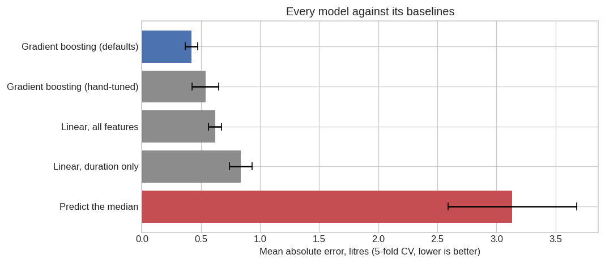
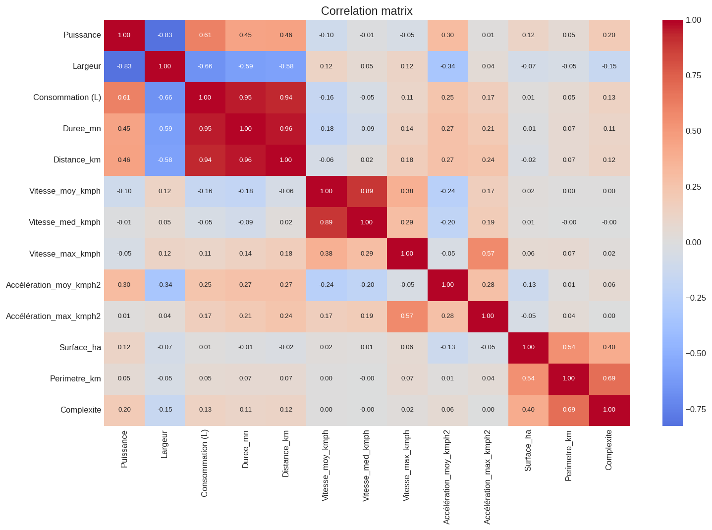
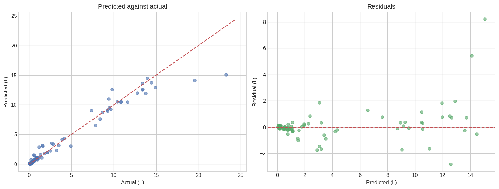

# Tractor Fuel Consumption Prediction

Predicting diesel consumption per agricultural intervention from GPS traces,
parcel geometry and equipment specifications, so that abnormal consumption —
mechanical faults, or fuel siphoned off between jobs — can be flagged against
what a job of that size *should* have taken.

**Result: 0.51 L mean absolute error on a held-out fifth of the data, against a
3.29 L naive baseline — a 6.5× improvement.** Cross-validated MAE is
0.42 ± 0.05 L on a target whose median is 1.24 L.

| Model | MAE (L) | vs. baseline |
|---|---|---|
| Predict the median | 3.135 ± 0.543 | 1.0× |
| Linear regression, duration only | 0.835 ± 0.096 | 3.8× |
| Linear regression, all features | 0.619 ± 0.055 | 5.1× |
| Gradient boosting, hand-tuned | 0.537 ± 0.113 | 5.8× |
| **Gradient boosting, defaults** | **0.421 ± 0.052** | **7.4×** |

*5-fold cross-validation on the training split. The hand-tuned configuration
reaches a training MAE of 0.0002 — it memorises the data — and generalises
worse than untouched defaults, so the defaults are what ships.*



## The problem, stated precisely

Duration and distance are recorded *while a job runs*. That makes them valid
inputs for **retrospective anomaly detection** and invalid for **forward fuel
planning**, where neither is known in advance. This project targets the first.
Using it for the second would require a different feature set, and the
distinction is enforced throughout rather than glossed over.

## Data

500 labelled interventions across 30 parcels, from three sources:

| Source | Contents |
|---|---|
| `interventions_train.csv` | Machine, engine power, tool, tool width, parcel, operation type, fuel consumed |
| `trajets_train/` | One GPS trace per intervention: timestamp, latitude, longitude, speed |
| `Parcelles/` | Boundary vertices of each parcel |

Twelve features are engineered from these: duration, geodesic distance, three
speed summaries, two acceleration summaries, and parcel area, perimeter and
vertex count (areas computed after reprojecting each polygon to its local UTM
zone, since degrees are not a unit of area).

> **Note on completeness.** `data/raw/trajets_train/` holds a 100-file sample of
> the 500 training traces; the full set is not redistributed. The complete
> engineered feature table is committed at `data/processed/merged_data.csv`, and
> notebook 1 verifies that the pipeline reproduces it to floating-point
> precision on the 100 overlapping rows. All published results are reproducible
> from this repository. One parcel outline is genuinely absent from the source
> data, affecting 4 interventions, which are median-imputed.

`interventions_test.csv` has no target column — it is an unlabelled holdout, so
it yields predictions, not scores.

## Running it

```bash
git clone https://github.com/AnasSABBAHI/tractor-fuel-consumption
cd tractor-fuel-consumption

python -m venv venv
source venv/bin/activate        # Windows: venv\Scripts\activate
pip install -r requirements.txt

jupyter lab
```

Run the notebooks in order:

1. `notebooks/1_feature_engineering_and_eda.ipynb` — builds features from raw
   traces, validates them against the stored table, explores the data
2. `notebooks/2_modeling.ipynb` — baselines, cross-validation, final holdout
   evaluation, predictions on the unlabelled test set

No paths need editing. Figures are written to `reports/figures/`, predictions to
`data/processed/predictions.csv`.

## Findings

**Duration and distance carry almost all the signal** (r = 0.95 and 0.94), which
is mechanically unsurprising — both measure how much work was done. Engine power
adds a genuine second axis at r = 0.61.

**Tool width is a trap.** It correlates at −0.66 with consumption, which invites
the conclusion that wider implements are more fuel-efficient. They are not.
Width is constant within two of the four operation types — spraying and
fertilising both use a 24 m boom — so it functions as a proxy for *which
operation this is*, and spraying is short and light while soil work is long and
heavy. Controlling for operation, the relationship largely evaporates. Width
stays in the model as a predictor; it is not a lever anyone can pull.



**Residual spread grows with job size**, as expected for a skewed positive
target. Operationally this means an anomaly threshold should be a percentage of
expected consumption, not a fixed number of litres — a fixed threshold would
flag every large job and no small one.



## Limitations

- **No hyperparameter search.** Defaults beat hand-picked values here; a proper
  search would likely beat both. This is the obvious next improvement.
- **500 rows.** Small enough that the holdout estimate carries real uncertainty,
  which is why cross-validated standard deviations accompany every score.
- **Retrospective only**, for the reason given above.
- **Single season, single operation.** Generalisation to other fleets, crops or
  terrain is untested.

## Layout

```
├── data/
│   ├── raw/            interventions, trajectory sample, parcel outlines
│   └── processed/      merged_data.csv (complete engineered table)
├── notebooks/          1_feature_engineering_and_eda, 2_modeling
├── src/
│   └── data_processing.py    trajectory and parcel feature extraction
├── reports/figures/    generated plots
└── requirements.txt
```

## License

MIT — see [LICENSE](LICENSE).
